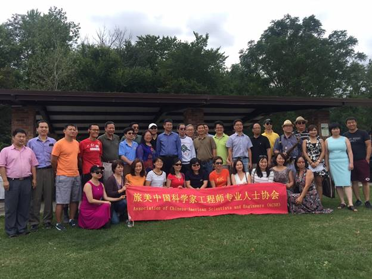
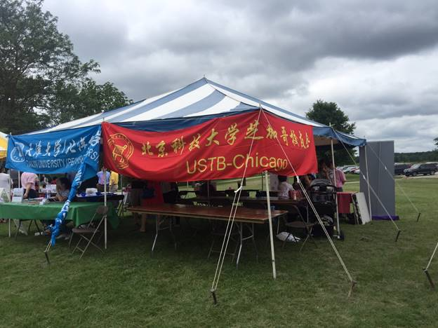
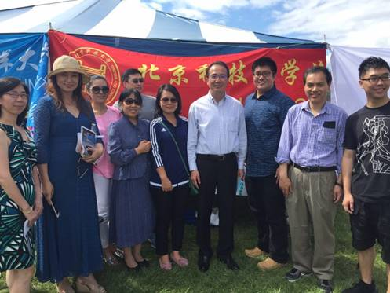
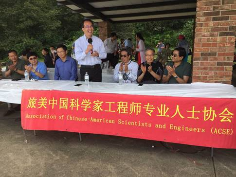
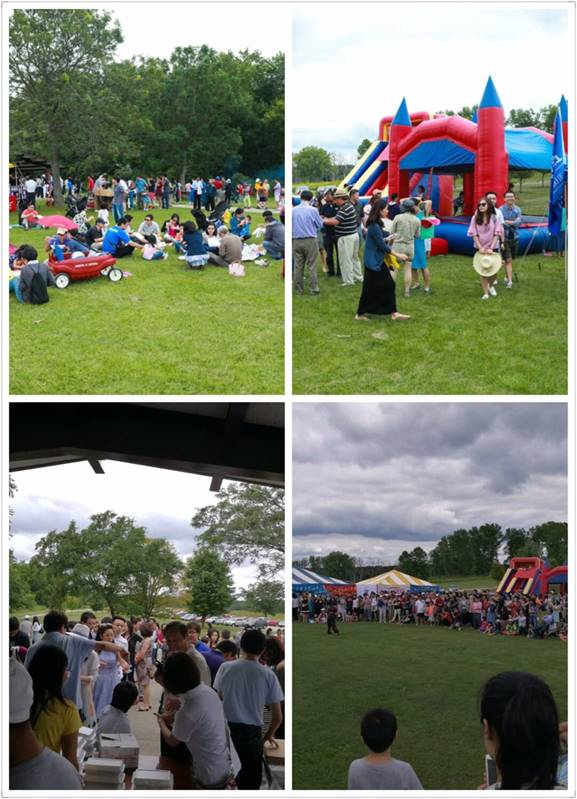
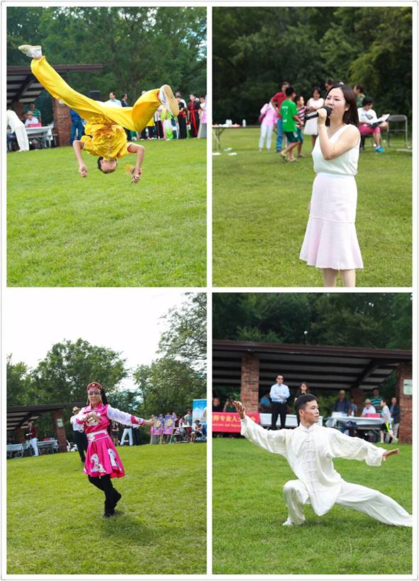
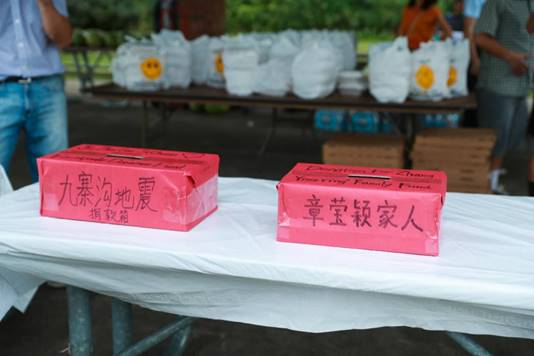
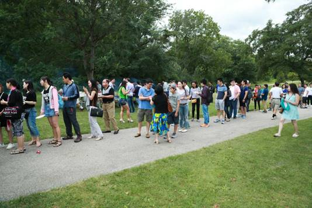
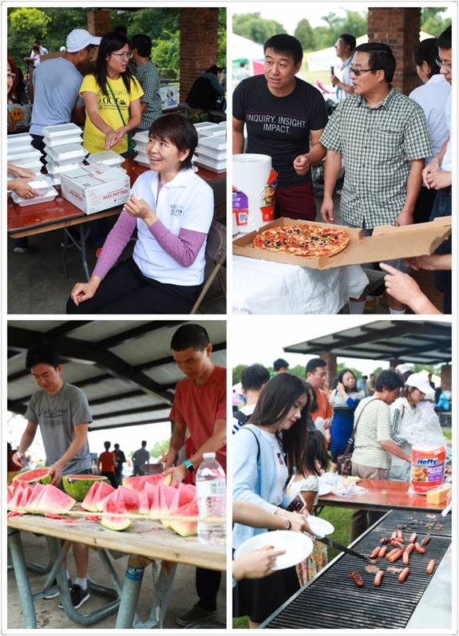

北科大芝加哥校友会聚焦2017科工专夏季野餐联谊会
-------------------------------------------

2017年 8月12日，  由旅美中国科学家工程师及专业人士协会（科工专）、北科大芝加哥校友会  、及各大院校校友会、华人团体联合举办的夏季野餐联谊会，在Deer Grove Forest (Palatine)公园圆满落下帷幕。

夏季野餐会已成功举办多年，每年都吸引了众多  华人华侨参加，成为芝加哥华人社区规模最大的一个户外野餐聚会活动，为旅美各界华人提供了一个良好的交流平台。本次野餐会，除了沿袭往年的精彩文艺武术表演外，还举行了以校友会及各专业协会为单位参加的家庭趣味活动、五公里团体接力长跑比赛等等，更有幸邀请到时任中国外交部新闻发言人、被誉为“中国第一天团”四宝之一的、现任芝加哥总领馆的洪磊总领事出席、致辞并与现场来宾亲切互动。

左二:  北京科技大学芝加哥校友会胡会长

而今年，对于我们贝壳人而言，尤为重要 ------ 这是北京科技大学芝加哥校友会自  今年4月成立以来，第一次以校友会的群体名义参加！

虽然是首次参加此类大型活动，我们贝壳人就主动承担了为现场600余位来宾及家属分发午餐的工作；同时，作为科工专的副会长兼司库，胡会长还负责联络、协调、服务到场的二十几个商家的工作。贝壳人的辛勤工作、付出，获得了与会者的一致肯定及好评。希望我们的队伍不断壮大，期待明年能有更多的贝壳人参加此盛会。

贝壳人与洪磊总领事合影留念。

洪磊总领事致辞

现场气氛热烈、人头攒动。

武术、歌曲表演，异彩纷呈。

海外华人华侨心系同胞，现场为九寨受灾人民及章莹颖家人捐款、祈福。

600余位来宾有序排队领午餐

参与义工工作，分发午餐。

文:  傅馨
